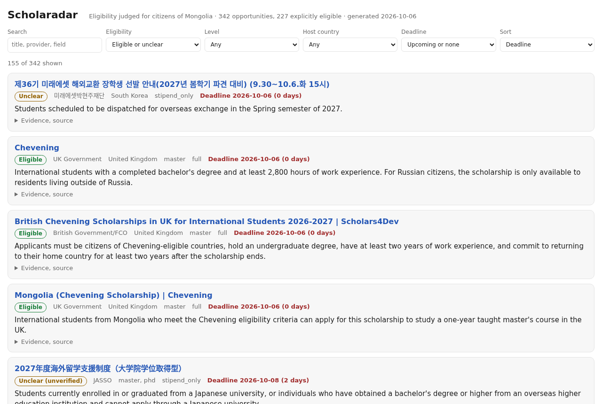

<h1 align="center">Scholaradar</h1>

<p align="center"><b>Every scholarship you are actually eligible for, found overnight, in any language, on your own computer.</b></p>

<p align="center">
  <a href="https://ssaruul.github.io/scholaradar/">Live dashboard</a> &middot;
  <a href="reports/latest.md">Today's report</a> &middot;
  <a href="#get-started-in-10-minutes">Get started</a> &middot;
  <a href="#make-it-yours">Make it yours</a> &middot;
  <a href="#questions">Questions</a>
</p>

<p align="center">
  
  
  
  
</p>

<p align="center"></p>

## The problem

Scholarships for studying abroad are scattered across thousands of university, embassy, foundation and ministry websites, written in Japanese, Korean, Chinese, Russian, German, Turkish and Mongolian as often as in English. Half of them quietly exclude your country in paragraph nine. Most students find out about the good ones after the deadline.

## What Scholaradar does

Every night it:

1. **Searches the web in 8 languages** for new scholarships, fellowships, grants and exchange programmes, and re-checks the official pages of 25 major programmes (MEXT, GKS, DAAD, Chevening, Fulbright, Türkiye Bursları, Stipendium Hungaricum and more).
2. **Reads every page with a local AI model** and pulls out the facts: who runs it, where, which degree level, how much is funded, and the deadline as a real date.
3. **Answers one question per page: "Can a citizen of my country apply?"** It must quote the exact sentence from the page that proves it. Explicit country lists and exclusions are checked by hand-written rules so the model cannot talk its way past them.
4. **Publishes the results** to a filterable dashboard, a dated Markdown report, a CSV, and (if you want) an email digest, sorted by deadline.

Built for Mongolian students. Change one block in a config file and it works for Kazakhstan, Vietnam, Nigeria or anywhere else.

## What you get

| | |
|---|---|
| **Dashboard** | One page, works offline, filter by country, degree level, deadline window and eligibility. `scholaradar open` launches it in your browser. [See it live](https://ssaruul.github.io/scholaradar/). |
| **Daily report** | A Markdown file per day in [`reports/`](reports/) with what is new and what closes in the next 30 days. Readable on GitHub from any phone. |
| **Spreadsheet** | `docs/opportunities.csv` with every field, ready for Excel or Google Sheets. |
| **Email digest** | New opportunities since yesterday, straight to your inbox. |
| **Evidence, not vibes** | Every "Eligible" comes with the sentence from the page that says so. "Unclear" means the page does not say, so you check. |

On its first day Scholaradar found **342 opportunities** across 6 languages, 227 of them explicitly open to Mongolian citizens.

## Free, private, yours

- **No API keys, no subscriptions.** Search runs through your own [SearXNG](https://github.com/searxng/searxng) instance, reading runs on your own GPU. The only cost is electricity.
- **Nothing leaves your machine** except the web requests any browser would make.
- **Open source, MIT.** Fork it, point it at your country, add your sources.

## Get started in 10 minutes

You need a computer with a GPU that has 16 GB or more of memory (an RTX 3090/4080/4090, RTX 5080/5090, or an AMD RX 7900/9070 class card), [Docker](https://docs.docker.com/get-docker/) for the search engine, and [uv](https://docs.astral.sh/uv/getting-started/installation/) to run Python.

**Linux**

```bash
git clone https://github.com/ssaruul/scholaradar && cd scholaradar
uv sync
cp .env.example .env

uv run scholaradar llm install --backend vulkan        # downloads llama.cpp, prints two lines to add to .env
uvx --from huggingface_hub hf download unsloth/gemma-4-26B-A4B-it-GGUF \
    gemma-4-26B-A4B-it-UD-Q4_K_M.gguf --local-dir ~/models/gguf

docker compose up -d searxng
uv run scholaradar init-db
uv run scholaradar nightly --open                      # first run: 20 to 40 minutes, then the dashboard opens
```

**Windows** (PowerShell, with Docker Desktop running)

```powershell
git clone https://github.com/ssaruul/scholaradar; cd scholaradar
uv sync
copy .env.example .env

uv run scholaradar llm install --backend vulkan        # or --backend cuda-12.8 on a recent NVIDIA driver
uvx --from huggingface_hub hf download unsloth/gemma-4-26B-A4B-it-GGUF gemma-4-26B-A4B-it-UD-Q4_K_M.gguf --local-dir $HOME\models\gguf

docker compose up -d searxng
uv run scholaradar init-db
uv run scholaradar nightly --open
```

Edit `.env` so `MODELS_DIR` points at the folder with the model file and paste the `LLAMA_MODE` / `LLAMA_BIN` lines that `llm install` printed. That is the whole setup.

**Run it every night**

- Linux: `crontab -e` and add `0 3 * * * /path/to/scholaradar/scripts/run_nightly.sh >> /path/to/scholaradar/data/logs/nightly.log 2>&1`
- Windows: `schtasks /Create /SC DAILY /ST 03:00 /TN Scholaradar /TR "powershell -File C:\path\to\scholaradar\scripts\run_nightly.ps1"`

The nightly job starts the model, runs the pipeline, writes the report and stops the model again so the GPU is free for whatever else you do with it.

## Make it yours

**Your country.** Open `config/settings.yaml` and replace the `target` block with your country's names in each language:

```yaml
target:
  name: Kazakhstan
  demonym: Kazakh
  names:
    en: [Kazakhstan, Kazakh]
    ru: [Казахстан, Казахстана, казахстанск]
    ja: [カザフスタン]
    ko: [카자흐스탄]
    zh: [哈萨克斯坦]
```

Then swap the country-specific lines in `config/queries.yaml` and add your ministry or embassy pages to `config/sources.yaml` with `implies_eligible: true` so their announcements count as eligible even when the page does not spell it out.

**Email.** Put your SMTP details (a Gmail app password works) in `.env`, set `outputs.email.enabled: true`, and test with `uv run scholaradar publish --send-test`.

**Publish your reports.** Set `GIT_PUSH=true` in `.env` and every night's report and dashboard are committed and pushed to your fork. Turn on GitHub Pages (Settings, Pages, deploy from `main` / `docs`) and your dashboard has a public URL.

**Google Sheets.** `uv sync --extra sheets`, add a service-account JSON, set `outputs.sheets` in `settings.yaml`.

**A different model or a hosted API.** Scholaradar talks to any OpenAI-compatible endpoint. Point `LLM_BASE_URL`, `LLM_MODEL` and `LLM_API_KEY` in `.env` at Ollama, vLLM or a cloud provider and skip the GPU entirely.

## Questions

**How accurate is it?** On 51 hand-labelled pages in six languages, the default model got the strict label (eligible / not eligible / unclear) right 80% of the time and never confused eligible with not eligible. The misses are pages that say "open to students from 150 countries" without naming them, where the model says eligible and a careful human says "probably". Deadlines were parsed correctly 100% of the time. Always confirm on the official page before you apply.

**Which GPU do I need?** 16 GB of GPU memory runs the 12B model; 24 GB runs the default 26B model comfortably. Four models were benchmarked; the default is the fastest of the ones that tied for accuracy. Details in the section below.

**Does it work without a GPU?** Yes, with a hosted model. See "A different model or a hosted API" above.

**Why is something missing?** Facebook pages are not crawled (many embassy posts live only there), sites behind aggressive bot protection are skipped, and JavaScript-only pages are not rendered. Add any page you care about to `config/sources.yaml` and it will be checked every night.

**Is my data shared?** No. Everything stays in the `data/` folder on your machine unless you turn on email or `GIT_PUSH`.

<details>
<summary><b>For tinkerers: commands, configuration, benchmarks</b></summary>

### Commands

| Command | What it does |
|---|---|
| `scholaradar nightly [--open]` | Start search engine and model, run everything, publish, stop the model |
| `scholaradar run` | Pipeline only (assumes the model is already running) |
| `scholaradar discover / fetch / extract / publish` | Individual stages |
| `scholaradar llm install --backend vulkan\|cuda-12.8\|cuda-13.4\|rocm\|cpu` | Download a prebuilt llama.cpp for this OS |
| `scholaradar llm start / stop / status` | Manage llama-server (native binary or Docker, per `LLAMA_MODE`) |
| `scholaradar open` | Open the dashboard in the default browser |
| `scholaradar serve [--port 8787]` | Serve the dashboard over HTTP and open it |
| `scholaradar status` | Page and opportunity counts |
| `scholaradar benchmark --model NAME` | Score the running model against `benchmark/labels.yaml` |

### Files

- `config/settings.yaml`: target nationality, languages, fetch and model limits, prefilter keywords, outputs.
- `config/sources.yaml`: anchor pages and feeds. `follow_links: true` also queues scholarship-looking links found on the page; `title_filter: true` keeps only feed items whose title mentions a scholarship; `implies_eligible: true` marks sources that only publish for your nationality.
- `config/queries.yaml`: search templates per language with `{year}`, `{target}`, `{demonym}` placeholders.
- `.env`: machine-specific values and secrets. `MODELS_DIR` may be a glob such as `/media/you/HDD*/models/gguf` for drives whose mount point changes.
- `docs/`: dashboard, `data.json`, CSV (served by GitHub Pages). `reports/`: dated Markdown reports. `data/`: SQLite database, raw pages, logs (not committed).

### Model benchmark

51 labelled pages (English, Mongolian, Russian, Japanese, Korean, Chinese), RTX 3090, llama.cpp Vulkan build b11433, Q4_K_M, 4 parallel slots.

| Model | Strict accuracy | Eligible/not-eligible swaps | Deadline accuracy | Time for the set | Gen tok/s |
|---|---|---|---|---|---|
| gemma-4-12b-it | 0.80 | 0 | 1.00 | 243 s | 68 |
| **gemma-4-26B-A4B-it** (default) | 0.80 | 0 | 1.00 | 161 s | 101 |
| Qwen3.5-27B | 0.80 | 0 | 0.95 | 337 s | 46 |
| gemma-4-31B-it (2 slots) | 0.78 | 0 | 1.00 | 495 s | 32 |

`scripts/bench_all.sh` reproduces the table. Labels live in `benchmark/labels.yaml`.

### How the eligibility check works

1. The model returns JSON constrained by a schema (llama.cpp grammar), including `target_eligible` and an `evidence_quote`.
2. The quote must appear verbatim in the page text, or the verdict is downgraded to `unclear`.
3. Deterministic rules then override the model: your country inside an explicit eligible-country list means `yes`; inside an exclusion list or next to "not eligible" wording means `no`; your country named only as the study destination is ignored.
4. Pages from sources marked `implies_eligible` turn `unclear` into `yes`.

### Docker vs native model server

`LLAMA_MODE=docker` uses `ghcr.io/ggml-org/llama.cpp:server-cuda` (needs the NVIDIA Container Toolkit and a driver supporting CUDA 12.8, i.e. 570 or newer). `LLAMA_MODE=native` runs a prebuilt llama.cpp release binary installed by `scholaradar llm install`; the Vulkan build works on older NVIDIA drivers and on AMD cards, on both Linux and Windows.

</details>

## License

MIT. If Scholaradar finds you a scholarship, tell someone else about it.
